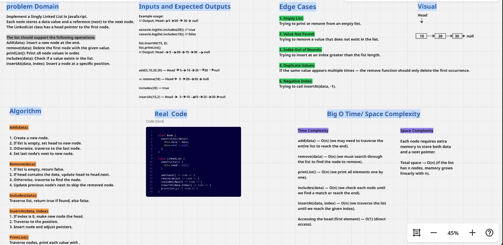
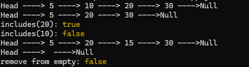

# Challenge 5 : *LinkedList*

## Description
In this challenge, we implement a custom **Linked List** in JavaScript as part of learning data structures.  
The solution includes a `Node` class and a `LinkedList` class with methods to add, remove, insert, search, and print nodes.  
The implementation also considers edge cases (such as empty lists and invalid indexes) and is tested using Jest to ensure correctness.
### ********************************************

### Whiteboard-Image :

### ********************************************
## Consol-output :
