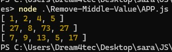

### Whiteboard Image

## Challenge 04: Remove Middle Value

## Description
Write a function that removes the value at the middle index of an array without using built-in methods, then returns the modified array.
